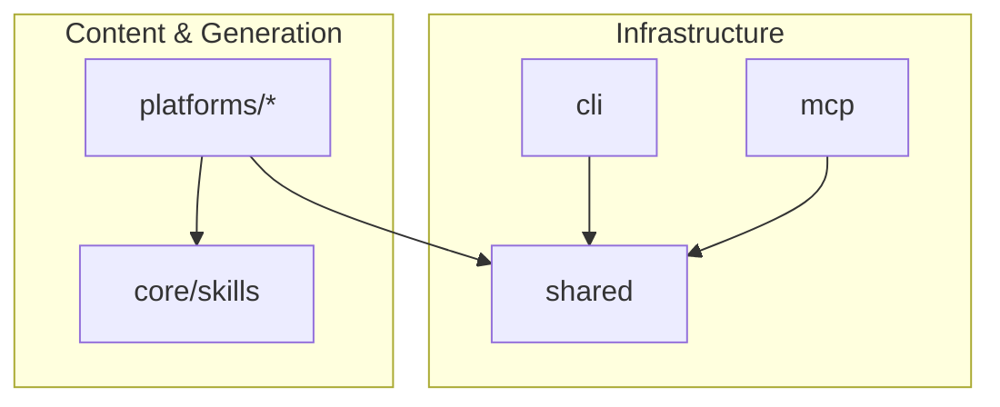
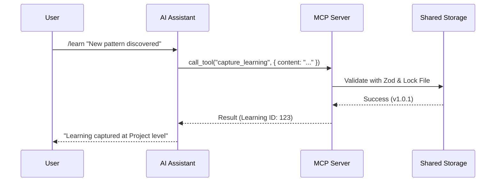

# Architecture Overview

phil-ai is a cross-platform AI plugin system designed for hierarchical agent workflows, documentation management, and continuous learning. This monorepo provides the infrastructure and generators required to support multiple AI platforms while maintaining a single source of truth for skill definitions.

## Monorepo Structure

The system is organized as a Bun-powered TypeScript monorepo where each package has a specific responsibility.

### Package Responsibilities

| Package | Path | Purpose |
|---------|------|---------|
| `@phil-ai/cli` | `cli/` | Main entry point for installation, status checks, and lifecycle management. |
| `@phil-ai/shared` | `shared/` | Core domain logic: Zod schemas, file-locked storage, and versioning utilities. |
| `@phil-ai/mcp` | `mcp/` | Model Context Protocol server providing platform-agnostic tool access. |
| `@phil-ai/platform-claude-code` | `platforms/claude-code/` | Generator for Claude Code plugins and marketplace index. |
| `@phil-ai/platform-opencode` | `platforms/opencode/` | Generator for unified OpenCode plugin modules. |
| `core/skills/` | `core/skills/` | Canonical reference definitions for skills (Learning, Docs, Context, Workflow). |

## Platform Strategy

phil-ai employs a dual-platform strategy that respects the native discovery mechanisms of each target environment.

### Claude Code: Decentralized Discovery
*   **Source of Truth**: External repositories (e.g., `pjbeyer/phil-ai-learning`) are the source of truth for Claude Code compatibility.
*   **Monorepo Role**: Acts as an infrastructure provider and marketplace indexer. It generates a `marketplace.json` that points to these external repositories.
*   **Installation**: Performed via Claude Code's native `/plugin install` command.

### OpenCode: Unified Integration
*   **Source of Truth**: The canonical skill definitions within this monorepo (and mirrored from external repos) are used to generate a unified plugin.
*   **Monorepo Role**: Directly generates and installs the plugin into the OpenCode environment.
*   **Installation**: Performed via `bunx phil-ai install`.

## Hierarchy Model

The system follows a **Hierarchy-First** principle where information exists at exactly one level to prevent drift and ensure token efficiency.

1.  **Global** (`~/Projects`): Cross-profile standards and universal patterns.
2.  **Profile** (`~/Projects/{profile}`): Workflow-specific tools (e.g., "Work" vs. "Personal").
3.  **Project**: Project-specific configurations and documentation.
4.  **Agent**: Individual agent capabilities and task-specific improvements.

## Data Flow

The following diagram illustrates how components interact during a typical operation (e.g., capturing a learning):

### Core Design Principles
*   **Dual-Platform Native**: Avoid wrappers; use native platform features wherever possible.
*   **Token Efficiency**: Load only the context required for the specific task and hierarchy level.
*   **Version-Aware State**: All persisted JSON/YAML files include `_version` metadata for safe schema evolution.
