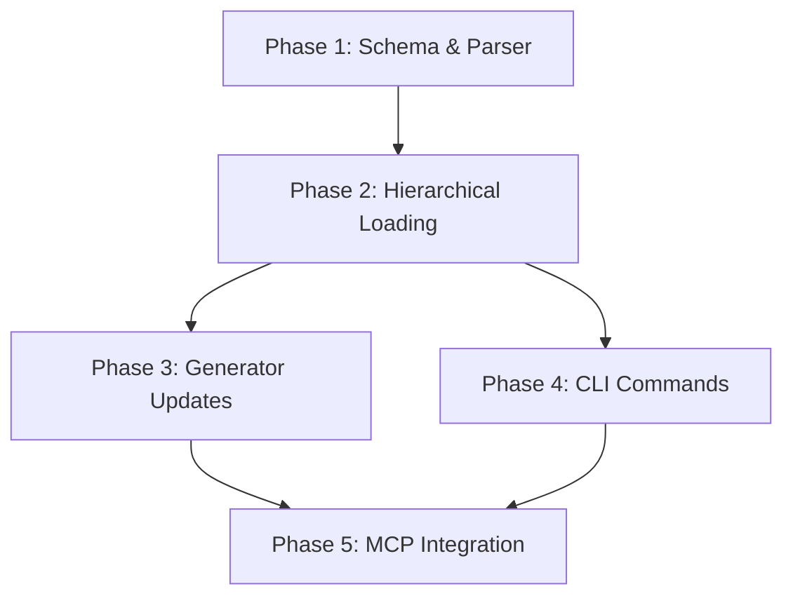

# Implementation Plan: System Guide

**Branch**: `feat/003-system-guide` | **Date**: 2026-01-11 | **Spec**: [spec.md](./spec.md)
**Input**: Feature specification from `/specs/003-system-guide/spec.md`

## Summary

Create a System Guide feature that allows coding agents to automatically consult user preferences, workflow patterns, and phil-ai architectural intent stored in `GUIDE.md` files. The guide uses Markdown with YAML frontmatter, following existing skill patterns, and integrates with both Claude Code and OpenCode platform generators.

## Technical Context

**Language/Version**: TypeScript 5.x (ES2022 target), Bun 1.x runtime  
**Primary Dependencies**: Zod (validation), gray-matter (frontmatter parsing), existing @phil-ai/shared utilities  
**Storage**: Hierarchical Markdown files (`GUIDE.md`) alongside `AGENTS.md` at global/profile/project levels  
**Testing**: Bun test runner with existing test infrastructure  
**Target Platform**: Claude Code and OpenCode (dual-platform native)  
**Project Type**: Monorepo extension (new skill + generator updates)  
**Performance Goals**: Guide loads in <2 seconds at session start  
**Constraints**: No new external dependencies beyond gray-matter; reuse existing patterns  
**Scale/Scope**: Single-user preferences, ~10-50 preferences per guide file

## Constitution Check

*GATE: Must pass before Phase 0 research. Re-check after Phase 1 design.*

| Principle | Status | Evidence |
|-----------|--------|----------|
| **I. Dual-Platform Native** | ✅ PASS | Guide format (MD + YAML frontmatter) works on both platforms. Generators updated to inject guide content. |
| **II. Hierarchy-First** | ✅ PASS | Guides stored at exactly one level (global/profile/project). Lower levels override higher. No duplication. |
| **III. Token Efficiency** | ✅ PASS | Guide loaded once at session start. Preferences parsed to minimal format. Configurable verbosity. |
| **IV. Version-Aware State** | ✅ PASS | Guide frontmatter includes `version` field. Follows same pattern as skill.json. |

**Verification Checklist:**
- [x] Commands defined once (markdown format, shared across platforms)
- [x] Information at correct hierarchy level (GUIDE.md per level, no duplication)
- [x] No unnecessary context loading (parsed once, minimal format)
- [x] All state files have version metadata (YAML frontmatter includes version)

## Project Structure

### Documentation (this feature)

```text
specs/003-system-guide/
├── spec.md              # Feature specification
├── plan.md              # This file
├── research.md          # Phase 0 output
├── data-model.md        # Phase 1 output
├── quickstart.md        # Phase 1 output
├── contracts/           # Phase 1 output
│   └── guide-schema.ts  # Zod schema for guide validation
└── tasks.md             # Phase 2 output (separate command)
```

### Source Code (repository root)

```text
# New files for System Guide feature
core/skills/guide/
├── skill.json           # Skill metadata (new skill category: "guide")
└── SKILL.md             # Skill instructions for agents

shared/src/
├── schemas/
│   └── guide.ts         # GuideSchema, PreferenceSchema (new)
├── guide/
│   ├── index.ts         # Public exports
│   ├── parser.ts        # GUIDE.md parsing (frontmatter + preferences)
│   ├── loader.ts        # Hierarchical guide discovery and merging
│   └── types.ts         # TypeScript interfaces
└── index.ts             # Add guide exports

platforms/claude-code/generator/
├── transform.ts         # Add guide category handling
└── guide.ts             # Guide injection into plugin output (new)

platforms/opencode/generator/
├── transform.ts         # Add guide category handling
└── guide.ts             # Guide injection into plugin output (new)

cli/src/commands/guide/
├── index.ts             # /guide command router
├── init.ts              # phil-ai guide init
├── show.ts              # phil-ai guide show
└── validate.ts          # phil-ai guide validate

mcp/src/tools/
└── guide.ts             # MCP tools for guide operations (new)

tests/
├── unit/
│   ├── guide/
│   │   ├── parser.test.ts
│   │   ├── loader.test.ts
│   │   └── schema.test.ts
│   └── schemas/
│       └── guide.test.ts
└── integration/
    └── guide-loading.test.ts
```

**Structure Decision**: Follows existing phil-ai patterns. Guide is a new skill category with shared parsing utilities. Platform generators updated to inject guide content. CLI commands optional but useful.

## Implementation Phases

### Phase 1: Core Schema & Parser (Foundation)

1. **GuideSchema** in `shared/src/schemas/guide.ts`
   - Zod schema for GUIDE.md frontmatter validation
   - PreferenceSchema for individual preferences
   - Export types and factory functions

2. **Guide Parser** in `shared/src/guide/parser.ts`
   - Parse GUIDE.md files (frontmatter + body)
   - Extract preferences from structured sections
   - Use gray-matter for frontmatter parsing

3. **Unit Tests** in `tests/unit/guide/`
   - Schema validation tests
   - Parser edge cases (empty, malformed, etc.)

### Phase 2: Hierarchical Loading

1. **Guide Loader** in `shared/src/guide/loader.ts`
   - Discover GUIDE.md files at hierarchy levels
   - Merge preferences with override semantics
   - Resolve conflicts (project > profile > global)

2. **Integration with directories.ts**
   - Add guide path resolution utilities
   - Follow existing pattern from getDataPaths()

3. **Integration Tests**
   - Multi-level guide discovery
   - Override behavior verification

### Phase 3: Platform Generator Updates

1. **Claude Code Generator**
   - Update `transform.ts` to handle "guide" category
   - Create `guide.ts` for guide content injection
   - Inject merged guide into plugin output

2. **OpenCode Generator**
   - Update `transform.ts` to handle "guide" category
   - Create `guide.ts` for guide content injection
   - Add guide tool to MCP tools list

3. **Skill Definition**
   - Create `core/skills/guide/skill.json`
   - Create `core/skills/guide/SKILL.md`

### Phase 4: CLI Commands (Optional Enhancement)

1. **`phil-ai guide init`** - Interactive guide creation
2. **`phil-ai guide show`** - Display merged guide
3. **`phil-ai guide validate`** - Syntax/conflict check

### Phase 5: MCP Integration

1. **Guide Tools** in `mcp/src/tools/guide.ts`
   - `get_guide` - Return merged guide for context
   - `list_preferences` - List active preferences
   - `check_preference` - Check if preference applies

## Dependencies



## Risk Mitigation

| Risk | Mitigation |
|------|------------|
| gray-matter adds dependency | Fallback: regex-based parser (already exists in constitution.md example) |
| Guide format too complex | MVP uses simple structure; advanced features deferred |
| Platform-specific parsing issues | Shared parser in @phil-ai/shared ensures consistency |
| Large guides impact performance | Parsed once, cached for session; configurable verbosity reduces output |

## Complexity Tracking

> No constitution violations requiring justification.

| Decision | Rationale | Simpler Alternative Considered |
|----------|-----------|-------------------------------|
| gray-matter dependency | Standard, well-tested, used by many tools | Regex parser (more fragile, less features) |
| Separate guide skill | Aligns with existing skill pattern | Embed in context skill (violates single-responsibility) |
| CLI commands optional | Core value is agent integration, not CLI | Skip CLI entirely (reduces accessibility) |
